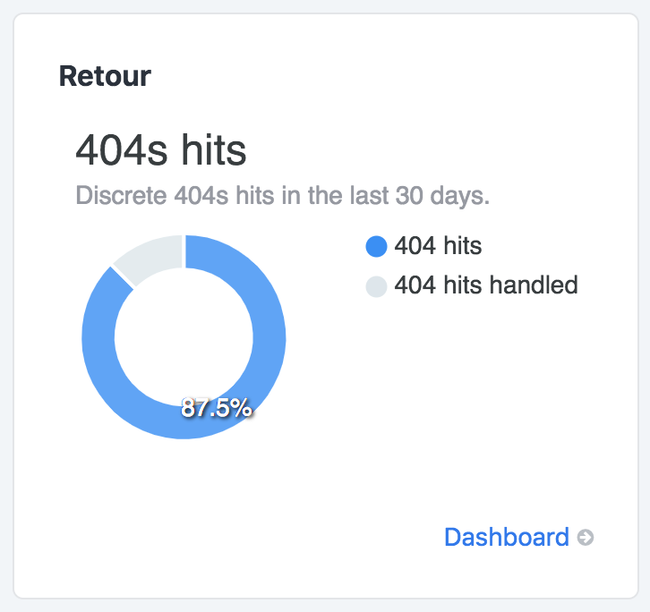

# Using Retour

## Retour Statistics

Retour keeps track of every 404 your website receives.  You can view them by clicking on **Retour->Dashboard**.  


If you're using Craft to host [multiple sites](https://docs.craftcms.com/v3/sites.html) you can view the statistics for **All Sites** or an individual site using the Sites menu at the top of the page.

You can sort by any column by clicking on the column name, and you can filter the results by typing in the **Search for:** field.

Only one record is saved per URL Pattern, so the database won't get clogged with a ton of records.

The charts show you how many directs happened during the last month, week, and day, including how many were handled by Retour.

The **Handled** column will display an `√` if the last 404 hit to this URL was handled by Retour, and an `x` if it was not.

Clicking on the `+` next to an unhandled 404 will create a new Static Redirect with the 404's URL set as the source.


Hovering over the **404 File Not Found URL** will give you more detailed information on the 404 that occurred.

### Exporting Statistics to a CSV File

The **Export CSV File** button on the **Retour->Statistics** page allows you to export all of your statistics to a CSV file for external processing or archival purposes.

## Retour Widget

If you'd like to see an overview of the Retour Statistics in your dashboard, you can add a Retour widget to your Dashboard:



It displays the total number of handled and not handled 404s, and the 5 most recent 404 URLs in each category right in your dashboard.

## GraphQL Query support

To retrieve Retour redirect data through the [CraftQL](https://github.com/markhuot/craftql) plugin, use the `retour` field in your graphql query.

This is useful if your website is a SPA, and Craft is running "headless", but you still want to give your content authors a way to deal with 404s.

You must as least pass in the URI you want metadata for:

```graphql
{
  retour(uri: "/stuff") {
    redirectDestUrl
  }
}
```

...and you can also pass in an optional `siteId`:

```graphql
{
  retour(uri: "/stuff", siteId: 1) {
    redirectDestUrl
  }
}
```
Whenever you query Retour via GraphQL, it assumes a 404 has already taken place, and records the statistics for it.

If not redirect can be found to handle the 404, `null` is returned:

```json
{
  "data": {
    "retour": null
  }
}
```

Otherwise the requested data will be returned:
```json
{
  "data": {
    "retour": {
      "redirectDestUrl": "/c3"
    }
  }
}
```


Most of the time, the only thing you'll care about is the `redirectDestUrl`, which is the route that the user should be redirected to. However, you can query for everything:

```graphql
{
  retour(uri: "/stuff") {
    id
    siteId
    associatedElementId
    enabled
    redirectSrcUrl
    redirectSrcUrlParsed
    redirectSrcMatch
    redirectMatchType
    redirectDestUrl
    redirectHttpCode
    hitCount
    hitLastTime
  }
}
```

...which results in something like this:
```json
{
  "data": {
    "retour": {
      "id": 1,
      "siteId": 1,
      "associatedElementId": 0,
      "enabled": true,
      "redirectSrcUrl": "/stuff",
      "redirectSrcUrlParsed": "/stuff",
      "redirectSrcMatch": "pathonly",
      "redirectMatchType": "exactmatch",
      "redirectDestUrl": "/c3",
      "redirectHttpCode": 301,
      "hitCount": 12,
      "hitLastTime": "2019-06-12 03:26:42"
    }
  }
}
```

Brought to you by [nystudio107](https://nystudio107.com/)
