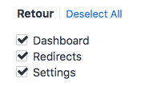
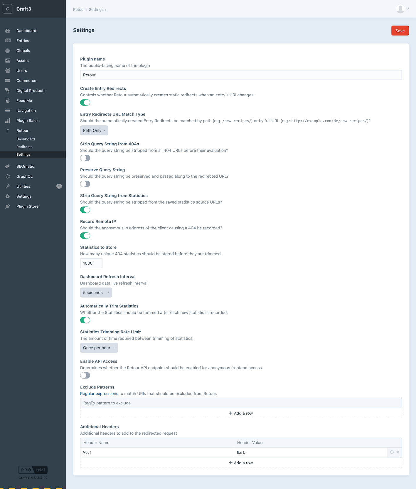

# Configuring Retour

## Permissions

If you are using Craft CMS "Pro" edition, Retour provides permissions that can be used to grant access to users based on their User Group. These are set in **Settings->Users->User Groups**:

* **Dashboard** - whether the user group has access to view the Retour Dashboard
* **Redirects** - whether the user group has access to viewing and changing Retour Redirects
* **Settings** - whether the user has access to viewing and changing the Retour Settings

You should also grant them the **Access Retour** permission under **General** permissions.

## Static Redirects

The **Retour->Redirects** page lists all of your static redirects. You can sort by any column by clicking on the column name, and you can filter the results by typing in the **Search for:** field.

Clicking on the `x` next to a static redirect will delete it.

The circle status on the left of each redirect indicates whether the redirect is enabled or not

### Manually Creating Static Redirects

Static Redirects are useful when the Legacy URL Patterns and the new URL patterns are deterministic. You can create them by clicking on **Retour->Redirects** and then clicking on the **New Static Redirect** button.

If you’re using Craft to host [multiple sites](https://docs.craftcms.com/v3/sites.html) you can view the redirects for **All Sites** or an individual site using the Sites menu at the top of the page.

* **Enabled** - Should this redirect be processed? Sometimes it is convenient to temporarily disable a redirect rather than outright delete it
* **Sites** - By default, the redirects you create affect **All Sites**. If you’re using Craft to host [multiple sites](https://docs.craftcms.com/v3/sites.html) you can also create redirects that only take effect for specific sites
* **Legacy URL Pattern** - Enter the URL pattern that Retour should match.  This matches against the path only (the part of the URL after the domain name), or the full URL, depending on the setting of **Legacy URL Match Type**.  For example: Exact Match: `/recipes/` or `http://example.com/recipes/`, or regular expression Match: `.*RecipeID=(.*)`
* **Legacy URL Match Type** - Should the legacy URL be matched by path (for example `/new-recipes/`) or by full URL (for example: `http://example.com/new-recipes/`)
* **Destination URL** - Enter the destination URL that should be redirected to.  This can either be a fully qualified URL or a relative URL.  For example: Exact Match: `/new-recipes/` or `http://example.com/new-recipes/`, or regular expression Match: `/new-recipes/$1`
* **Pattern Match Type** - What type of matching should be done with the Legacy URL Pattern. Details on regular expression matching can be found at [regexr.com](http://regexr.com). If a plugin provides a custom matching function, you can select it here.
* **Redirect Type** - Select whether the redirect should be permanent or temporary.

### Automatic Slug Redirects

If you rename an Entry’s `slug` (or any other Element with URLs), Retour will automatically create a static redirect for you to keep traffic going to the right place.  It will also automatically create a static redirect if you move an entry around in a Structure.

It will appear listed under the "Static Redirects" section like any other static redirect.

The **Create Entry Redirects** setting in **Retour->Settings** allows you to enable or disable this feature.

### Exporting Redirects to a CSV File

The **Export CSV File** button on the **Retour->Redirects** page allows you to export all of your redirects to a CSV file for external processing or archival purposes.

### Importing Redirects from a CSV File

Retour allows you to import redirects from a CSV file, with a GUI that allows you to choose how to map the data:

The first row of data in the CSV file should be the headings for the columns.

Choose the fields to import into Retour from the CSV file by dragging them in the appropriate order. Click on the `x` to delete an unused field.

The **Match Type** field must be either `exactmatch` or `regexmatch` (case sensitive). Anything left blank will be filled in with default values.

### Redirect Loop Prevention

Retour will automatically prevent the creation of a "redirect loop". If you create a new redirect that’s destination URL is the same as the source URL of an existing redirect, it will remove the older redirect.

## Settings

The **Retour->Settings** page allows you to configure various site-wide settings for Retour:

* **Plugin name** - The public-facing name of the plugin
* **Create Entry Redirects** - Controls whether Retour automatically creates static redirects when an entry’s URI changes.
* **Strip Query String from 404s** - Should the query string be stripped from all 404 URLs before their evaluation?
* **Preserve Query String** - Should the query string be preserved and passed along to the redirected URL?
* **Strip Query String from Statistics** - Should the query string be stripped from the saved statistics source URLs?
* **Record Remote IP** - Should the anonymous ip address of the client causing a 404 be recorded?
* **Statistics to Store** - How many unique 404 statistics should be stored before they are trimmed.
* **Dashboard Refresh Interval** - Dashboard data live refresh interval for the chart and table data
* **Automatically Trim Statistics** - Whether the Statistics should be trimmed after each new statistic is recorded. If you turn this off, statistics will only be trimmed when you visit the Retour Dashboard page in the Control Panel, or you run the `retour/stats/trim` console command (see below).
* **Statistics Trimming Rate Limit** - Whether the Statistics should be trimmed after each new statistic is recorded.
* **Enable API Access** - Determines whether the Retour API endpoint should be enabled for anonymous frontend access.
* **Exclude Patterns** - [Regular expressions](https://regexr.com/) to match URIs that should be excluded from Retour.
* **Additional Headers** - Additional HTTP headers to add to the redirected request
   
Brought to you by [nystudio107](https://nystudio107.com/)
